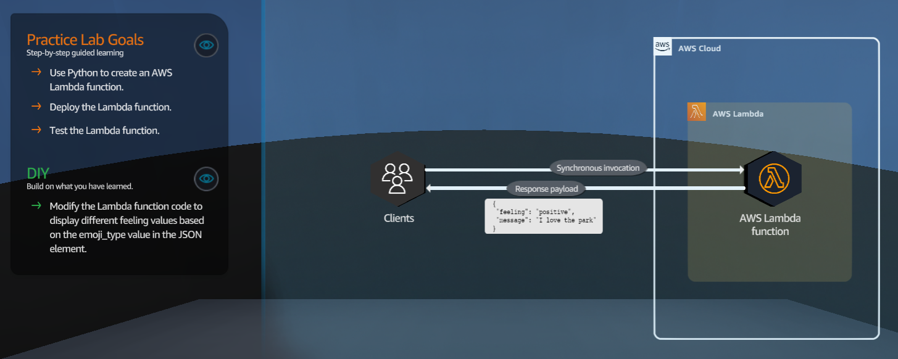

In this file we will walkthrough Data Analytics csenarios
## A - Serverless Foundations

<figure>
    
    <figcaption></figcaption>
</figure>

### A.1 Pratice Lab Goals
1 - Use Python to create an AWS Lambda functions

2 - Deploy the Lambda  function

3 - Test the Lambda function

### A.2 DIY
1 - Modufy the Lambda function code to display different feeling values based on emoji_type value in the JSON element.
