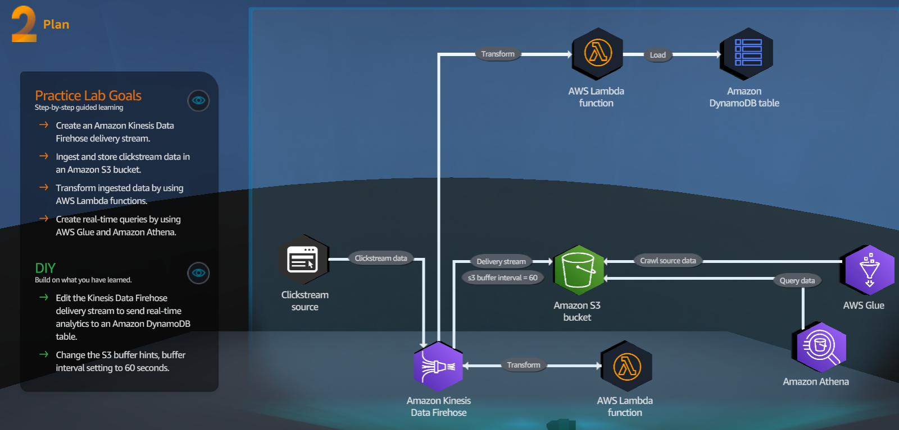

In this file we will walkthrough Data Analytics csenarios
## A - Serverless Foundations

<figure>
    
    <figcaption></figcaption>
</figure>

### A.1 Pratice Lab Goals
1 - Use Python to create an AWS Lambda functions

2 - Deploy the Lambda  function

3 - Test the Lambda function

### A.2 DIY
1 - Modify the Lambda function code to display different feeling values based on emoji_type value in the JSON element.

## B - Data Ingestion Methods

<figure>
    
    <figcaption></figcaption>
</figure>

### B.1 Pratice Lab Goals
1 - Create an Amazon Kinesis Data Firehose delivery stream.

2 - Ingest and store clicstream data in an Amazon S3 bucket.

3 - Transform ingested data by using AWS Lambda functions.

4 - Create real-time queries by using AWS Glue and Amazon Athena.

### B.2 DIY
1 - Edit the Kinesis data Firehose delivery streams to send real-time analytics to an Amazon DynamoDB table.

2 - Change the S2 buffer hints, buffer interval setting to 60 seconds.