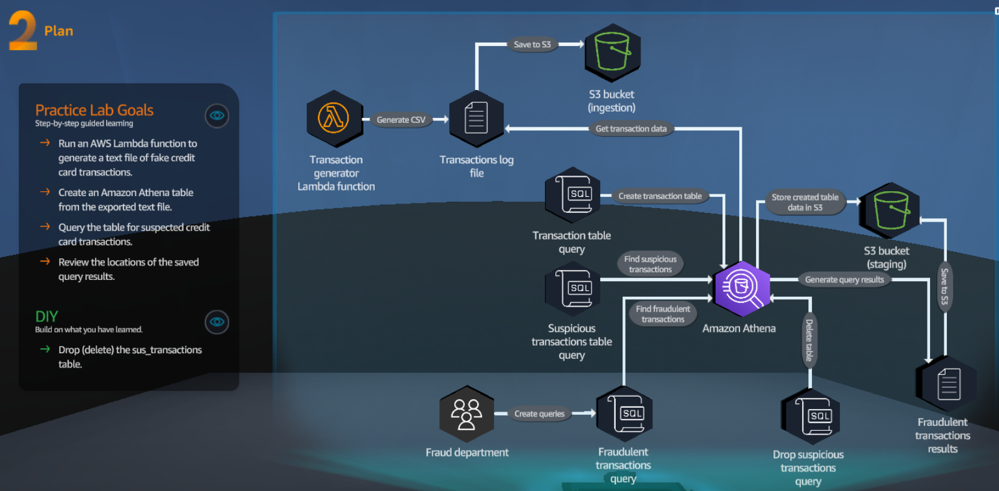
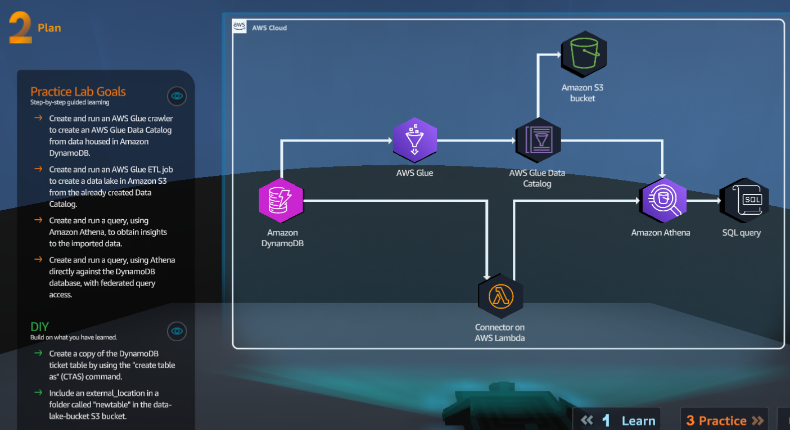
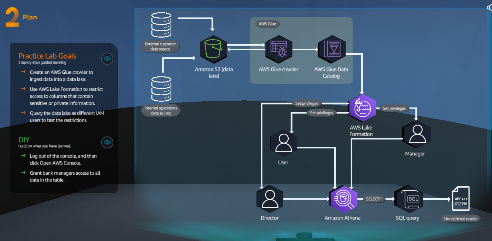
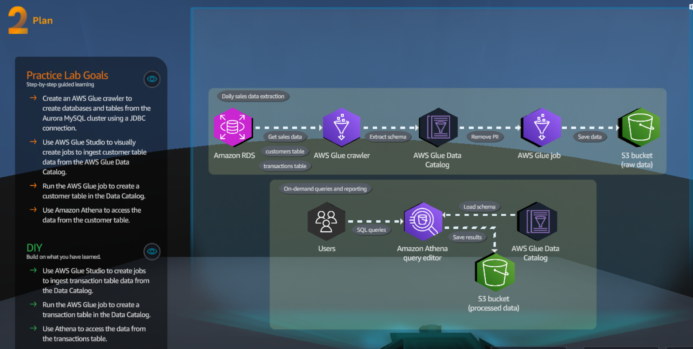
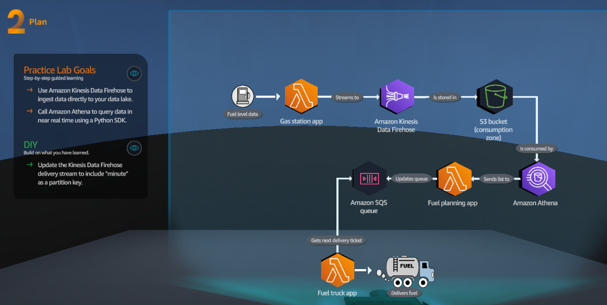
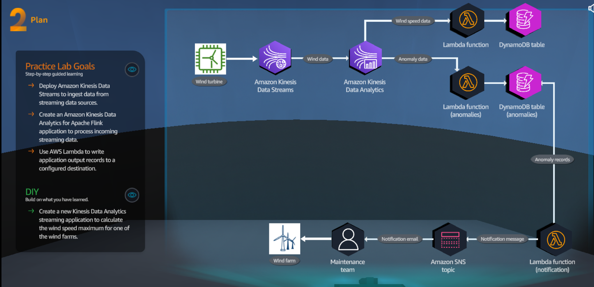
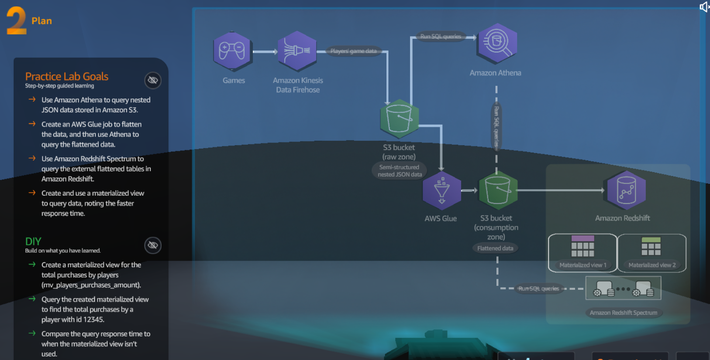

In this file we will walkthrough Data Analytics csenarios
## A - Serverless Foundations

<figure>
    
    <figcaption></figcaption>
</figure>

### A.1 Pratice Lab Goals
1 - Use Python to create an AWS Lambda functions

2 - Deploy the Lambda  function

3 - Test the Lambda function

### A.2 DIY
1 - Modify the Lambda function code to display different feeling values based on emoji_type value in the JSON element.

## B - Data Ingestion Methods

<figure>
    
    <figcaption></figcaption>
</figure>

### B.1 Pratice Lab Goals
1 - Create an Amazon Kinesis Data Firehose delivery stream.

2 - Ingest and store clicstream data in an Amazon S3 bucket.

3 - Transform ingested data by using AWS Lambda functions.

4 - Create real-time queries by using AWS Glue and Amazon Athena.

### B.2 DIY
1 - Edit the Kinesis data Firehose delivery streams to send real-time analytics to an Amazon DynamoDB table.

2 - Change the S2 buffer hints, buffer interval setting to 60 seconds.

## C - Data Lakes

<figure>
    
    <figcaption></figcaption>
</figure>

### C.1 Pratice Lab Goals
1 - Use Amazon S3 as a storage layer of a data lake.

2 - Organize data into layers (or zones) in Amazon S3.

3 - Configure an S3 event notification to invoke an AWS Lambda functions.

4 - Create aan Amazon EventBridge rule to invoke the Lambda function.

### C.2 DIY
1 - Create a second EnventBridge rule to invole the labFunction-DIY-Processor Lambda function.

2 - Update the labFunction-DIY-Processor Lamnbda functions environment variables with S3 bucket names creates in the lab.

3 - Invoke the labFunction-Data-Generator Lambda function  and verify that a new ``.csv`` files was created in the consumption zone S3 bucket.

**Note:**

1.  [Recommended data layers](https://docs.aws.amazon.com/prescriptive-guidance/latest/defining-bucket-names-data-lakes/data-layer-definitions.html)

2. [Data lake foundation](https://docs.aws.amazon.com/whitepapers/latest/building-data-lakes/data-lake-foundation.html)

3. [Modern data architecture layers deep-dive](https://docs.aws.amazon.com/whitepapers/latest/modern-data-architecture-rationales-on-aws/modern-data-architecture-layers-deep-dive.html)

4. [Defining S3 bucket and path names for data lake layers on the AWS Cloud](https://docs.aws.amazon.com/prescriptive-guidance/latest/defining-bucket-names-data-lakes/welcome.html)

5. [Google-Amazon storage layer for data lake](https://www.google.com/search?q=Amazon+storage+layer+for+data+lake&oq=Amazon+storage+layer+for+data+lake&aqs=chrome..69i57j69i64.9127j1j7&sourceid=chrome&ie=UTF-8#ip=1)

## D - Query Data Lakes

<figure>
    
    <figcaption></figcaption>
</figure>

### D.1 Pratice Lab Goals
1 - Run an AWS Lambda function to generate a text file of fake credit card transactions.

2 - Create an Amazon Athena table from the exported txt file.

3 - Query the table for suspected credit card transactions.

4 - Review the locations of the saved query results.

### D.2 DIY
1 - Drop (delete) the ``sus_transactions`` table.

## E - Fedarated Queries

<figure>
    
    <figcaption></figcaption>
</figure>

### E.1 Pratice Lab Goals
1 -Create and run an AWS Glue crawler to create an AWS Glue Data Catalog from data housed in Amazon DynamoDB.

2 - Create and run an AWS Glue ETL job to create a data lake in AMazon S3 from the already created Data atalog.

3 - Create and run a query, using Amazon Athena,, to obtain insights to the importes data.

4 - Cretae and run a query, using Athena directly againts the DynamoDB database, with federated query access.

### E.2 DIY
1 - Create a copy of the DynamoDB ticket table by using the **create table as** (CTAS) command.

2 - Include an external_location in a folder called **newtable** in the data-lake S3 bucket.

**Note:*
1. [CREATE TABLE AS](https://docs.aws.amazon.com/athena/latest/ug/create-table-as.html)

2. [CREATE TABLE](https://docs.aws.amazon.com/athena/latest/ug/create-table.html)

3. [Examples of CTAS queries](https://docs.aws.amazon.com/athena/latest/ug/ctas-examples.html#ctas-example-partitioned)

## F - Populating the Data Catalog

<figure>
    
    <figcaption></figcaption>
</figure>

## G - Securing the Data Lake

<figure>
    
    <figcaption></figcaption>
</figure>

**Note:**

1. [Granting Data Catalog permissions using the named resource method](https://docs.aws.amazon.com/lake-formation/latest/dg/granting-cat-perms-named-resource.html)

2. [Data filtering and cell-level security in Lake Formation](https://docs.aws.amazon.com/lake-formation/latest/dg/data-filtering.html)

## H - Daily Batch Extraction

<figure>
    
    <figcaption></figcaption>
</figure>

## I - Streaming Ingestion

<figure>
    
    <figcaption></figcaption>
</figure>

## J - Real Time Data Streaming

<figure>
    
    <figcaption></figcaption>
</figure>

## K - CLoud Data Warehouse

<figure>
    
    <figcaption></figcaption>
</figure>